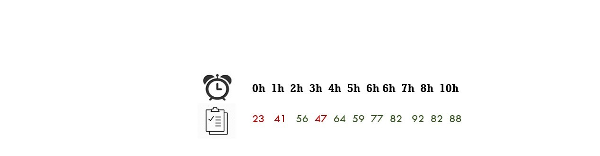
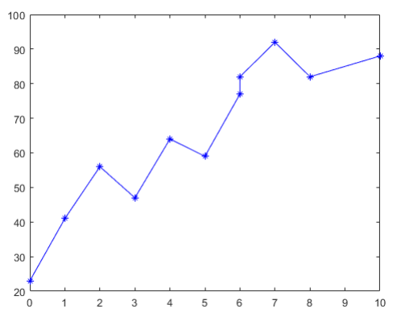
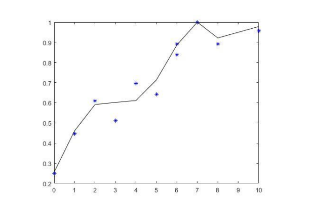
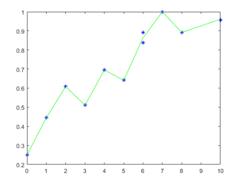

#  The method of least squares on Matlab

# What for?

If you have a set of data

Did you know that in math it is possible to find a function
which produces its same set of data regardless of how they are arranged?

So yes! using The method of least squares we can do it, we can predict what are the next sequence values or any other values
of a data set

*This code is the application of that math method* 

# Projet issues 

<h3>General Introduction</h3>

Being able to draw conclusions about data trends is one of the most important steps in business and science.
Often, the questions we ask ourselves force us to make predictions.This projet describes a
relationship between time spent reviewing and grade, we try to mathematically generate a function that describes the behavior
of notes as a function of time. Of course, this example is not as realistic as it is claimed because in reality
there are other factors envolved, such as the quality of the student etc, etc , but we will ignore factors of
confusion like this for now and work a simple example.
Everyone already knows that there is a positive relationship between time spent reviewing and grade.
that we get, but we're going to need some data to demonstrate it correctly.

The method of least squares makes it possible to select among these functions the one which reproduces the better experimental data. We speak in this case of adjustment by the least method squares.The method consists of a prescription (empirical method), which is that the function fα (x) which best describes the data is that which minimizes the quadratic sum of the deviations of the measures to the predictions of y (x). I presume that you also snow how The method of least squares works, if not search on wikipedia for this details cause this part is just the application of it
</img>

let a set of measures  ῼ = { (x1, y1) , (x2, y2) .......(xn, yn) } 
we search :

fα (x )= α0 + α1x + α2x² + …… αNxN

with : 

α ={ α0 , α1 , α2 , α3 , α4 , α5 , α6 …… αN } 

</img>
</img> 
                             
Remark the first graph has N=6 and the last one has N=9

# Note Analysis: 

We can clearly see that our function fα (x) for ***N = 6*** does not approach very well y (x) for
the polynomials of N = 7 and 8. The best approximation is that of the polynomial of degree ***N = 9***, by
tests I found that degrees greater than 9 were also shown to be bad approximations.

